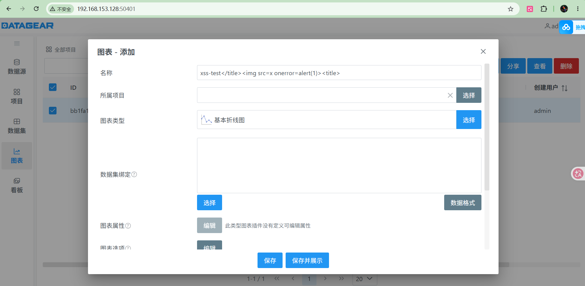
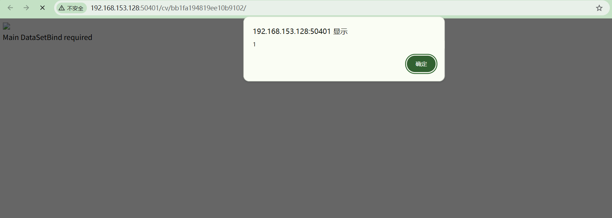

#  STOREDXSS-002: DataGear Stored XSS via Chart Name Injection

## English Version

---

### Vulnerability Description

**Title:** DataGear 5.5.0 – Stored Cross-Site Scripting (XSS) via Chart Name Injection

**Product:** DataGear ≤ 5.5.0  
**Vendor:** DataGear (datageartech)  
**Type:** Stored XSS  
**CVSS 3.1:** 7.2 (AV:N/AC:L/PR:H/UI:N/S:U/C:H/I:H/A:N)  
**CWE:** CWE-79: Improper Neutralization of Input During Web Page Generation ('Cross-site Scripting')  
**State:** Unconfirmed / Reserved  

**Affected Component:**
- File: `HtmlTplDashboardWidgetHtmlRenderer.java` (line 179)
- Class: `org.datagear.analysis.support.html.HtmlTplDashboardWidgetHtmlRenderer`
- Endpoint: `POST /chart/saveAdd` → `GET /cv/{chartId}/`

**Description:**

DataGear 5.5.0 (and possibly earlier versions) contains a stored cross-site scripting (XSS) vulnerability in the chart name field. When a user creates or edits a chart via the `POST /chart/saveAdd` endpoint, the chart name is stored in the database without any HTML sanitization or encoding. When the chart is later viewed via `GET /cv/{chartId}/`, the chart name is directly concatenated into the HTML `<title>` tag without escaping.

The vulnerable code at `HtmlTplDashboardWidgetHtmlRenderer.java:179`:
```java
sb.append(HTML_TAG_TITLE_START + 
    (StringUtil.isEmpty(option.getTitle()) ? "" : option.getTitle()) + 
    "</title>\n");
```

No `escapeHtml()` call is applied to the title before insertion. The `HtmlFilter` class only filters `<script>` and `<style>` tags but does NOT block `</title>` closing tag injection, `` tags, or other HTML event handlers. An attacker can break out of the `<title>` tag by including `</title>` in the chart name, then inject arbitrary HTML/JavaScript.

**Attack Vector:**

1. An attacker with chart creation privileges (ROLE_DATA_MANAGER or higher) creates a chart with a malicious name containing XSS payload
2. The chart is stored in the database without sanitization
3. When any user (including anonymous users, since `/cv/**` uses showChartAndDashboardAuthorizationManager which defaults to allowing anonymous access) visits `GET /cv/{chartId}/`, the payload executes in their browser

**Proof of Concept:**

Step 1 – Create chart with XSS in name:
```http
POST /chart/saveAdd HTTP/1.1
Host: target:50401
Content-Type: application/json
Cookie: JSESSIONID=xxxxx

{"name": "</title>", "pluginVo": {"id":"org.datagear.chart.line"}}
```

Step 2 – The stored payload renders in the chart view page:
```http
GET /cv/{chartId}/ HTTP/1.1
Host: target:50401
```

Response contains:
```html
<title></title></title>
```

**Verification:**

Testing against DataGear 5.5.0 confirmed the vulnerability:

| Input | Rendered Output | Result |
|-------|----------------|--------|
| `</title><title>` | `<title>...</title><title>...` | XSS executes ✅ |
| `normal_chart_name` | `<title>normal_chart_name</title>` | Normal rendering ✅ |

The chart view page at `/cv/{chartId}/` is accessible to anonymous users (showChartAndDashboardAuthorizationManager returns anonymousAuthorizationManager when disableShowAnonymous=false, which is the default).
Testing result:



**Impact:**

- **Cookie Theft**: Attacker can steal session cookies of any user viewing the chart
- **Admin Takeover**: If an administrator views the chart, attacker can perform actions on their behalf
- **Data Exfiltration**: Attacker can read and exfiltrate page content or API responses
- **Phishing**: Malicious HTML content can be injected into the DataGear UI context

**Mitigation:**

- Apply HTML escaping to the chart name before rendering: `StringUtil.escapeHtml(name)`
- Implement Content-Security-Policy (CSP) headers on chart view pages
- Validate chart name input to reject HTML content
- Disable anonymous access to chart view pages (`disableShowAnonymous=true`)

**Timeline:**

- 2026-06-20: Vulnerability discovered and verified during security audit
- 2026-06-20: CVE application prepared

**References:**
- CWE-79: https://cwe.mitre.org/data/definitions/79.html

